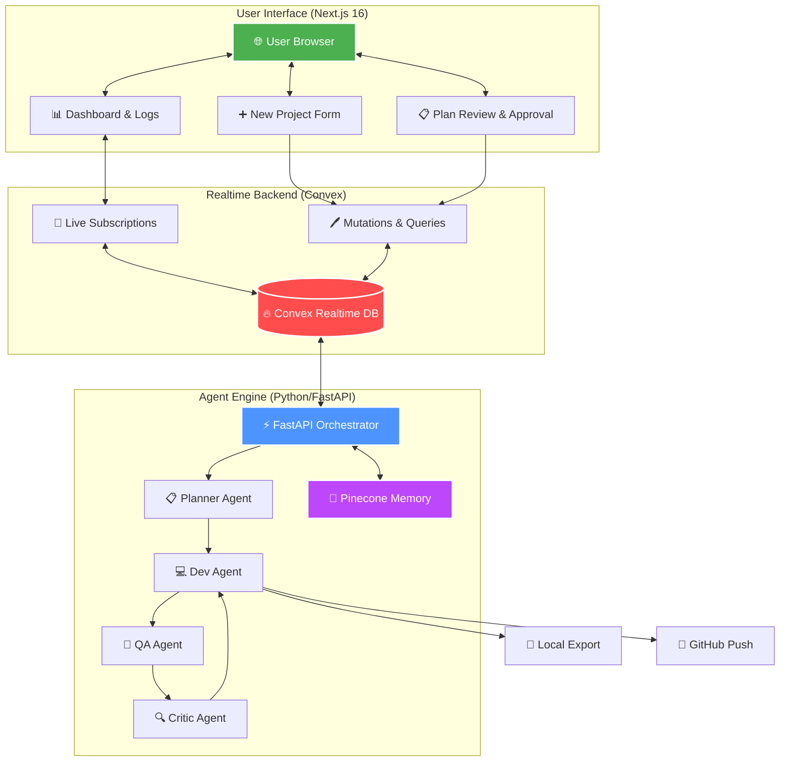

# 🤖 AgentForge — Autonomous AI Software Company

> **"Give it a requirement. Get back a complete codebase."**

AgentForge is a production-grade, multi-agent AI platform that functions as an **Autonomous AI Software Company**. Users submit a natural-language software requirement, and an orchestrated team of specialized AI agents — Planner, Developer, QA Engineer, and Critic — collaborates autonomously to design, write, test, and export a production-ready Next.js + Convex codebase. Every step is visible in real-time via a polished dashboard with a mandatory human-in-the-loop approval gate.

---

## 📌 Table of Contents

- [Why AgentForge?](#-why-agentforge)
- [Architecture Overview](#-architecture-overview)
- [Project Structure](#-project-structure)
- [Tech Stack](#-tech-stack)
- [The AI Engineering Team](#-the-ai-engineering-team)
- [Data Flow](#-data-flow)
- [Key Features](#-key-features)
- [Getting Started](#-getting-started)
- [Environment Variables](#-environment-variables)
- [What You Learn From This Project](#-what-you-learn-from-this-project)

---

## 🌟 Why AgentForge?

Traditional AI coding assistants (Copilot, ChatGPT) assist individual developers — they write a function when asked. AgentForge goes a level above: it models an **entire software company** inside a single automated pipeline.

| Traditional AI Coding | AgentForge |
|---|---|
| Completes one task at a time | Orchestrates a full multi-step project |
| No verification loop | QA + Critic feedback loop |
| No architectural planning | Dedicated Planner agent designs the system |
| No real-time visibility | Live dashboard with streaming agent logs |
| Manual file management | Auto-exports project + pushes to GitHub |

This project matters because it demonstrates how **multi-agent systems are changing software development**: from assistants to autonomous engineers.

---

## 🏗 Architecture Overview




The system has **three independent services** that work together:

1. **Convex** — Realtime database + serverless backend. Acts as the single source of truth and enables live UI updates without polling.
2. **Next.js Frontend** — Dashboard UI. Reads from Convex in real time; writes project submissions and plan approvals.
3. **Python Agent Engine** — FastAPI server. Hosts all AI agents, orchestrates their execution, writes logs back to Convex, and exports final code.

---

## 📁 Project Structure

```
AgentForge/
│
├── frontend/                    # Next.js 16 Application
│   ├── src/
│   │   ├── app/
│   │   │   ├── page.tsx         # Home dashboard — lists all projects
│   │   │   ├── layout.tsx       # Root layout with ConvexProvider + Sidebar
│   │   │   ├── globals.css      # Global styles (Tailwind v4)
│   │   │   ├── new/
│   │   │   │   └── page.tsx     # "New Project" form page
│   │   │   ├── project/
│   │   │   │   └── [id]/
│   │   │   │       └── page.tsx # Individual project dashboard (logs, plan, approval)
│   │   │   └── api/
│   │   │       └── agents/plan/
│   │   │           └── route.ts # API bridge → fires request to Python backend
│   │   └── components/
│   │       ├── Sidebar.tsx      # Navigation sidebar
│   │       └── ConvexClientProvider.tsx  # Convex React provider wrapper
│   └── convex/                  # Convex backend functions & schema
│       ├── schema.ts            # Database schema (projects, plans, tasks, agentLogs)
│       ├── projects.ts          # CRUD + status mutations for projects
│       ├── plans.ts             # Plan save/fetch/approve/reject
│       ├── tasks.ts             # Task creation and status tracking
│       └── logs.ts              # Agent log append + query
│
├── agent-engine/                # Python AI Agent Engine
│   ├── main.py                  # FastAPI app — /api/plan, /api/execute endpoints
│   ├── convex_client.py         # Python Convex SDK wrapper (logs, status, plans)
│   ├── github_integration.py    # GitHub API: repo creation + file push
│   └── agents/
│       ├── prompts.py           # All system prompts for every agent (single source of truth)
│       ├── planner.py           # Planner agent — PydanticAI + structured PlanResult output
│       ├── dev.py               # Dev agent — outputs list of files with full content
│       ├── qa.py                # QA agent — pass/fail verdict with feedback
│       └── critic.py            # Critic agent — actionable fix instructions
│
├── ExportedProjects/            # AI-generated codebases saved here (git-ignored)
├── .gitignore
└── README.md
```

---

## 🛠 Tech Stack

### Frontend
| Technology | Version | Purpose |
|---|---|---|
| **Next.js** | 16 (App Router) | React framework, routing, API routes |
| **React** | 19 | UI component library |
| **Tailwind CSS** | v4 | Utility-first styling (`@tailwindcss/postcss`) |
| **Convex** | 1.x | Realtime database, serverless mutations/queries |
| **TypeScript** | 5.x | Type safety across the entire frontend |
| **Lucide React** | — | Icon library |

### Agent Engine (Python)
| Technology | Version | Purpose |
|---|---|---|
| **FastAPI** | — | HTTP API server for agent orchestration |
| **Uvicorn** | — | ASGI server to run FastAPI |
| **PydanticAI** | — | Structured AI agent framework (typed outputs) |
| **Pydantic** | v2 | Data validation and structured LLM response parsing |
| **Convex Python SDK** | 0.7.x | Write logs, status updates, and plans back to DB |
| **OpenRouter** | — | LLM provider gateway (routes to GPT-4o, Claude, etc.) |
| **python-dotenv** | — | Environment variable management |
| **PyGitHub / GitHub API** | — | Create repositories and push generated files |

### Infrastructure
| Service | Purpose |
|---|---|
| **Convex Cloud** | Managed realtime DB + serverless deployment |
| **Pinecone** | Vector database for long-term agent memory and RAG (Retrieval Augmented Generation) |
| **OpenRouter** | Unified API for multiple LLMs (GPT-4o, Claude 3.5, etc.) |
| **GitHub API** | Auto-push generated project codebases to new repositories |

---

AgentForge uses **Pinecone** as its "Long-term Memory" layer. This allows the agent team to move beyond a stateless pipeline and build persistent context:
- **Project Retrieval**: The Planner Agent automatically searches Pinecone for architectural patterns from previous projects to inform new designs (RAG).
- **Persistent Knowledge**: Stores project requirements and architectures to ensure the AI "learns" from every generation.
- **Cross-Agent Context**: Enables the system to maintain a high-quality codebase by referencing successful historical patterns.

---

## 🤖 The AI Engineering Team

AgentForge's power comes from **specialization** — instead of one generic LLM trying to do everything, four narrowly-scoped agents each own a critical phase of the software development lifecycle.

---

### 1. 📋 Planner Agent (`planner.py`)

**Role:** Lead Software Architect

**Why it matters:** No code can be good if the plan is bad. The Planner prevents the "blank page" problem by converting a vague natural-language requirement into a precise technical blueprint before any code is written. It provides structure that every downstream agent depends on.

**What it does:**
- Reads the user's requirement
- Designs the full-stack architecture: Next.js App Router structure, Convex database schema, API routes, and component hierarchy
- Produces a structured `PlanResult` with `architecture_overview` (markdown) and a list of granular `TaskDef` objects
- Stores the plan and tasks in Convex — triggers the human approval gate

**Output type:** `PlanResult { architecture_overview: str, tasks: List[TaskDef] }`

---

---

### 2. 💻 Dev Agent (`dev.py`)

**Role:** Senior Full-Stack Developer

**Why it matters:** Represents the highest-value automation in the system — transforming a blueprint directly into deployable code. It strictly follows modern conventions (Next.js 15, Tailwind v4, Convex validators) as enforced by its system prompt.

**What it does:**
- Takes the Planner's architectural blueprint as input
- Writes every file: `app/layout.tsx`, `app/page.tsx`, `convex/schema.ts`, `package.json`, `postcss.config.mjs`, etc.
- Outputs a validated list of `FileDef` objects (path + full content)
- No stubs, no TODOs — complete, runnable code only

**Output type:** `DevResult { files: List[FileDef], explanation: str }`

---

---

### 3. 🧪 QA Agent (`qa.py`)

**Role:** Quality Assurance Engineer

**Why it matters:** LLMs hallucinate. Without a verification step, broken code would be silently exported. The QA Agent acts as a safety net — catching mistakes before they reach disk or GitHub.

**What it does:**
- Receives the full set of generated files in memory
- Checks for: missing imports, schema/component mismatches, broken API patterns, incomplete implementations
- Produces a boolean pass/fail verdict and detailed feedback string

**Output type:** `QAResult { passed: bool, feedback: str }`

---

---

### 4. 🔍 Critic Agent (`critic.py`)

**Role:** Senior Staff Engineer / Code Reviewer

**Why it matters:** Closes the self-healing loop. When QA fails, the system doesn't crash — the Critic diagnoses the root cause and issues precise correction instructions, enabling the Dev Agent to iterate. This creates an **autonomous refinement loop** without human intervention.

**What it does:**
- Receives the Dev's implementation summary + QA's failure report
- Analyzes the root cause of each failure
- Outputs an actionable set of instructions for the Dev Agent to fix
- Drives the feedback loop until QA passes (or max iterations reached)

**Output type:** `CriticResult { approved: bool, feedback: str }`

---

## 🔄 Data Flow (Step-by-Step)

```
1. User submits requirement on /new page
       ↓
2. `projects:createProject` Convex mutation creates a project (status: "planning")
       ↓
3. Next.js API route POST /api/agents/plan fires request to Python backend
       ↓
4. [PLANNER AGENT] Designs architecture → saves plan + tasks to Convex (status: "waiting_approval")
       ↓
5. UI shows plan to user → User clicks "Approve" or "Reject"
       ↓
6. On approval → POST /api/execute → [DEV AGENT] writes full codebase in memory
       ↓
7. [QA AGENT] verifies the generated code
       ↓
8a. QA PASS → Files exported to ExportedProjects/ + pushed to GitHub (status: "done")
8b. QA FAIL → [CRITIC AGENT] generates fix instructions → Dev loops again
       ↓
9. All logs stream live to the project dashboard via Convex subscriptions
```

---

## ✨ Key Features

- **🔄 Real-time Agent Logs** — Every agent writes status messages to Convex. The UI subscribes and shows a live log stream — no polling, no refresh needed.
- **👤 Human-in-the-Loop** — The system pauses after planning. The user reviews and approves or rejects the architectural plan before any code is written.
- **🤖 Autonomous Feedback Loop** — If QA fails, the Critic + Dev agents automatically iterate without user intervention.
- **📦 Auto Export to Disk** — Generated projects are saved as real, runnable codebases in `ExportedProjects/project_{id}/`.
- **🐙 Auto GitHub Push** — Approved and verified codebases are automatically pushed to a new GitHub repository.
- **🔄 API Resilience & Retries** — Built-in `tenacity` retry loops and high timeouts (300s) ensure the system recovers from transient OpenRouter/OpenAI 502/504 errors.
- **🧠 Structured LLM Outputs** — All agents use PydanticAI with typed output models — no string parsing, no hallucinated JSON.
- **🛡 Convex Type-Safe Backend** — All database operations use Convex validators (`v.string()`, `v.id()`, etc.) for end-to-end type safety.

---

## 🚀 Getting Started

### Prerequisites

- **Node.js** v20+
- **Python** v3.11+
- **Convex** account ([dashboard.convex.dev](https://dashboard.convex.dev))
- **OpenRouter** API key ([openrouter.ai](https://openrouter.ai))
- **GitHub** Personal Access Token (for repo creation)

### 1. Clone the Repository

```bash
git clone https://github.com/your-username/agentforge.git
cd agentforge
```

### 2. Set Up the Frontend

```bash
cd frontend
npm install
```

Create `frontend/.env.local`:
```env
NEXT_PUBLIC_CONVEX_URL=https://your-deployment.convex.cloud
CONVEX_DEPLOYMENT=dev:your-deployment
```

Start Convex + Next.js:
```bash
# Terminal 1 — Convex dev server
npx convex dev

# Terminal 2 — Next.js dev server
npm run dev
```

Frontend will be live at **http://localhost:3000**

### 3. Set Up the Agent Engine

```bash
cd agent-engine
python -m venv venv

# Windows
venv\Scripts\activate

# macOS/Linux
source venv/bin/activate

pip install fastapi uvicorn pydantic-ai pydantic convex python-dotenv PyGithub
```

Create `agent-engine/.env`:
```env
NEXT_PUBLIC_CONVEX_URL=https://your-deployment.convex.cloud
OPENROUTER_API_KEY=sk-or-...
OPENROUTER_BASE_URL=https://openrouter.ai/api/v1
OPENROUTER_MODEL=openai/gpt-4o
GITHUB_TOKEN=ghp_...
GITHUB_USERNAME=your-github-username
```

Start the agent engine:
```bash
python main.py
```

Agent Engine will be live at **http://localhost:8000**

---

## 🔐 Environment Variables

| Variable | Location | Description |
|---|---|---|
| `NEXT_PUBLIC_CONVEX_URL` | `frontend/.env.local` + `agent-engine/.env` | Convex deployment URL |
| `CONVEX_DEPLOYMENT` | `frontend/.env.local` | Convex deployment name for CLI |
| `OPENROUTER_API_KEY` | `agent-engine/.env` | API key for LLM access via OpenRouter |
| `OPENROUTER_BASE_URL` | `agent-engine/.env` | OpenRouter base URL |
| `OPENROUTER_MODEL` | `agent-engine/.env` | LLM model slug (e.g., `openai/gpt-4o`) |
| `PINECONE_API_KEY` | `agent-engine/.env` | Pinecone API key |
| `PINECONE_INDEX` | `agent-engine/.env` | Pinecone index name |
| `VECTOR_STORE_PROVIDER` | `agent-engine/.env` | Usually `pinecone` |
| `GITHUB_TOKEN` | `agent-engine/.env` | GitHub PAT with `repo` scope |
| `GITHUB_USERNAME` | `agent-engine/.env` | GitHub username for repo creation |

---

## 📚 What You Learn From This Project

Building AgentForge teaches you skills that sit at the cutting edge of modern software engineering:

### 1. 🧠 Multi-Agent System Design
How to decompose a complex task across specialized agents — and why decomposition produces better results than a single "do everything" prompt. You learn about agent orchestration, feedback loops, and the SDLC modeled as an AI pipeline.

### 2. 🏗 Structured LLM Outputs with PydanticAI
How to move beyond raw string responses from LLMs. PydanticAI enforces typed, validated outputs (`BaseModel`) — making AI outputs as reliable as a typed function return value. This is the pattern modern production AI systems use.

### 3. ⚡ Realtime Full-Stack Architecture with Convex
How Convex replaces the traditional REST API + database + WebSocket stack with a single, reactive platform. You learn Convex schema definition with `v` validators, live queries with `useQuery`, mutations, and cross-language SDK usage (TypeScript + Python).

### 4. 🔁 Human-in-the-Loop AI Workflows
How to design AI systems that pause and seek human confirmation at critical decision points — a fundamental pattern in trustworthy AI deployment. The plan approval gate is a practical example of this principle.

### 5. 🛡 Prompt Engineering at Scale
How prompt design directly determines output quality and correctness. The `prompts.py` file shows how to write system prompts that enforce strict constraints (no placeholders, correct import paths, proper Tailwind classes) to prevent hallucination.

### 6. 🌐 Full-Stack TypeScript + Python Integration
How a Next.js API route can act as a clean bridge between a TypeScript frontend and a Python backend — keeping each service in its best-fit language while communicating over HTTP.

### 7. 🐙 Automated GitHub Integration
How to use the GitHub API programmatically to create repositories and commit files — a key skill for building developer tools, CI/CD utilities, and autonomous software systems.

### 8. 📦 Code Generation as a First-Class Feature
How to design an AI system that treats generated source code as structured data — with explicit file paths, content validation, and disk I/O — rather than just printing text to a chat window.

---

## 📄 License

MIT — free to use, modify, and distribute.
